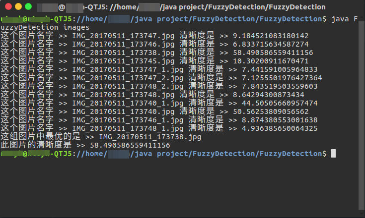

# FuzzyDetection
图片择优（选择最清楚的图片）

> 实现思路 <a href="http://python.jobbole.com/83702/">参考链接</a>

1. 获取图片的灰度图数组
2. 使用拉普拉斯算子进行卷积运算 {0, 1, 0, 1, -4, 1, 0, 1, 0}
3. 获取结果的方差
4. 与其他图片进行 结果比较 得到图片的清晰度结论

> 代码环境

JAVA 1.8

> 命令执行

在FuzzyDetection目录下
 1. 编译代码  
 ```javac FuzzyDetection.java```   

 2. 执行 (images是图片的文件夹名称)  
 ```java FuzzyDetection images```  

> 分析图片结果


